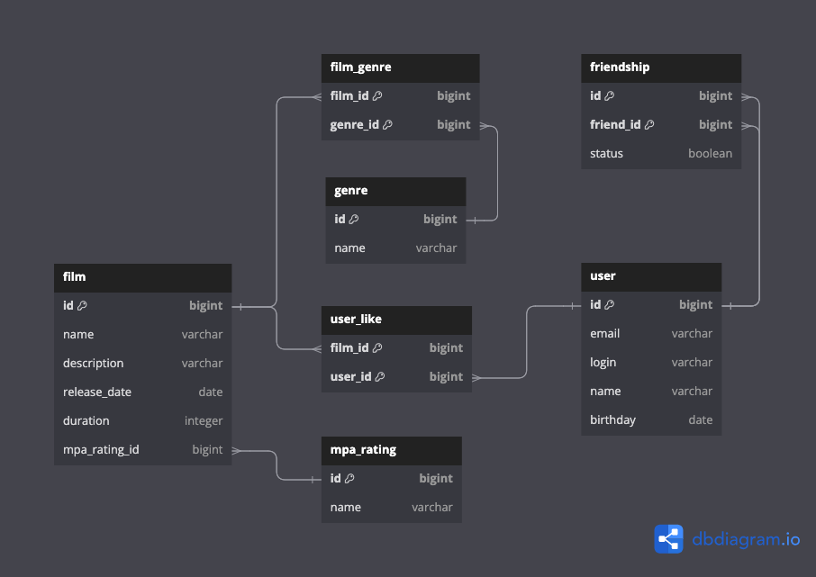

# [FILMORATE](https://github.com/natalaly/java-filmorate) 

1. [ER - diagram](#er-diagram)
2. [Description](#tables-description)

## ER diagram [^1]

## Tables Description

User

The `User` table stores information about the users of the Filmorate application.

| Column   | Type    | Constraints                      | Notes                 |
|----------|---------|----------------------------------|-----------------------|
| id       | bigint  | PK                               | unique identification |   
| email    | varchar | not null, unique                 | user email            |
| login    | varchar | not null, unique,max length: 255 | user login            |
| name     | varchar | not null, max length: 255        | user name             |
| birthday | date    | not null                         | user birthday         |

Friendship

The `Friendship` table captures the friendship relationships between users.

| Column    | Type    | Constraints      | Notes                                             |
|-----------|---------|------------------|---------------------------------------------------|
| id        | bigint  | PK, FK(users.id) | part of composite PK, references user ID          |   
| friend_id | bigint  | PK, FK(users.id) | part of composite PK, references friend's user ID |
| status    | bool    | default = false  | defines if friendship is confirmed                |

Film

The `Film` table holds information about the films available in the application.

| Column        | Type    | Constraints                        | Notes                           |
|---------------|---------|------------------------------------|---------------------------------|
| id            | bigint  | PK                                 | unique identification for films |   
| name          | varchar | not null, max length: 255          | film name                       |
| description   | varchar | null,max length: 1000              | film description                |
| release_date  | date    | not null                           | film release date               |
| duration      | integer | not null, note: 'Must be positive' | film duration in minutes        |
| mpa_rating_id | bigint  | FK(mpa_ratings.id)                 | references MPA rating ID        |

User_Like

The `User_Like` table represents the films liked by users. Certain User can "like" a certain film only once.

| Column  | Type   | Constraints      | Notes                                    |
|---------|--------|------------------|------------------------------------------|
| film_id | bigint | PK, FK(films.id) | part of composite PK, references film ID |
| user_id | bigint | PK, FK(users.id) | part of composite PK, references user ID | 

Film_Genre

The `Film_Genre` a junction table to establish a many-to-many relationship between films and genres.
Each film can be associated with multiple genres, and A single genre (from "Genre" table) can be associated with multiple films.

| Column   | Type   | Constraints       | Notes                                     |
|----------|--------|-------------------|-------------------------------------------|
| film_id  | bigint | PK, FK(films.id)  | part of composite PK, references film ID  |   
| genre_id | bigint | PK, FK(genres.id) | part of composite PK, references genre ID |

Genres

The `Genre` table lists the various genres that films can belong to.

| Column | Type    | Constraints                       | Notes                           |
|--------|---------|-----------------------------------|---------------------------------|
| id     | bigint  | PK                                | unique identification for genre |   
| name   | varchar | not null, unique, max length: 255 | genre name                      |

| id | name          |
|----|---------------|
| 1  | Comedy        |
| 2  | Drama         |
| 3  | Animation     |
| 4  | Thriller      |
| 5  | Documentary   |
| 6  | Action        |

Mpa_Ratings

The `Mpa_Rating` table contains the various Motion Picture Association (MPA) ratings 
that can be assigned to films, indicating the appropriate age restrictions.
Each film can have one MPA rating, but each MPA rating can be associated with many films.

| Column | Type    | Constraints                       | Notes                            |
|--------|---------|-----------------------------------|----------------------------------|
| id     | bigint  | PK                                | unique identification for rating |   
| name   | varchar | not null, unique, max length: 255 | rating name                      |

| id | name  |                                               
|----|-------|
| 1  | G     |                                              
| 2  | PG    |                        
| 3  | PG-13 |                                  
| 4  | R     | 
| 5  | NC-17 |

[^1]: [Peer Review Link](https://github.com/natalaly/er-diagram-filmorate/pull/1)